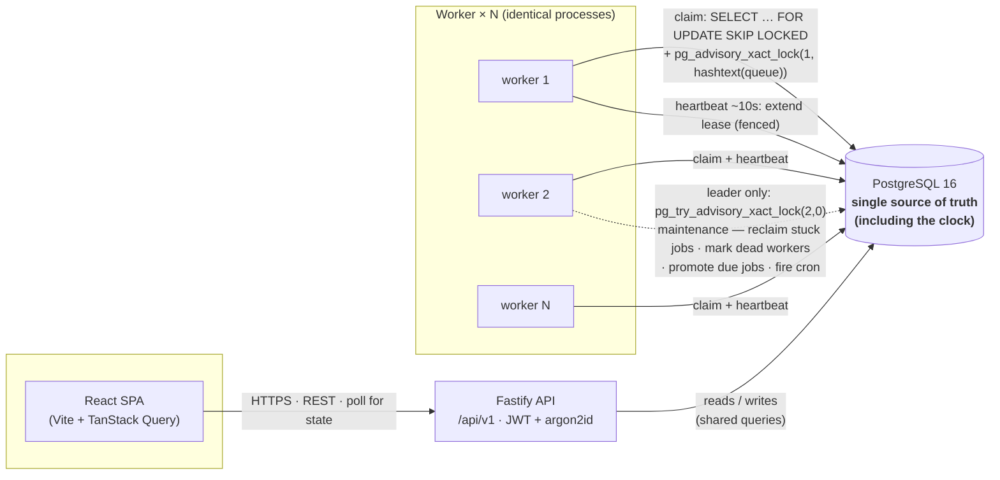

# Architecture

A distributed job scheduler built as a monorepo. "Distributed" here means a
**coordination story**, not a Kubernetes deployment: N identical worker
processes agree on who does what using nothing but PostgreSQL. There is no
message broker, no Redis, no ZooKeeper, and no separate scheduler daemon.

## System overview

The dashed edge is the maintenance loop. **Every** worker runs it, but its four
writes are each gated by a non-blocking `pg_try_advisory_xact_lock(2, 0)`; only
the one worker that wins the lock does the work, and the rest fall through as
no-ops. Leadership is therefore not a role assigned at startup — it is decided
per tick, by whoever grabs the lock, and it survives any worker dying because
the advisory lock is released the instant that worker's session ends.

## "Distributed = coordination story, not Kubernetes"

The whole system is **three deployable services** plus one database:

| Service | Package | Scale | Role |
|---|---|---|---|
| `web` | `packages/web` | 1 (static) | React 18 dashboard, polls the API |
| `api` | `packages/api` | horizontal | Fastify 5 REST, stateless (JWT), org-scoped |
| `worker` | `packages/worker` | **× N** | claims and runs jobs; one is leader for maintenance |

Everything that must be agreed on lives in **PostgreSQL, the only shared
state**. Time is read from the DB clock (`now()`), never from a worker's wall
clock, so lease expiry and cron due-times are computed against one authority
and clock skew between machines is irrelevant. There is **no separate scheduler
process**: the reaper, the promoter, and the cron firer run *inside* the worker
binary, and leader election among the workers (via the advisory lock above)
guarantees exactly one of them acts at a time. That is what keeps the deployable
surface at three services instead of five while still being genuinely
multi-process fault-tolerant — proven by a 2-terminal `kill -9` recovery demo
and a 4-claimer concurrency integration test.

## The worker's three self-scheduling loops

All three loops use self-rescheduling `setTimeout` (never `setInterval`), so a
slow or hung tick can never overlap its successor, and a thrown error is caught
and logged without killing the loop. Defaults are from `.env.example`.

**Poll loop (~1 s, jittered).** Each tick lists the claimable queues, then for
each queue claims `min(freeSlots, queueBudget, batchCap)` jobs and dispatches
them to the in-process async pool. `freeSlots()` is re-read *live* before every
per-queue claim (not snapshotted once per tick), so a worker cannot locally
over-claim past `WORKER_CONCURRENCY` across several queues in one tick. If it
filled capacity, it ticks again immediately to drain the backlog; otherwise it
sleeps `POLL_INTERVAL_MS` with ±20% jitter so co-started workers don't
lockstep-hammer the same advisory lock.

**Heartbeat loop (~10 s = `LEASE_MS/3`).** Updates `workers.last_heartbeat_at`
and bulk-extends `locked_until` for this worker's currently-running jobs, so a
live worker's leases never lapse under it. The 3× headroom tolerates two missed
beats before the reaper would consider the worker dead. Critically, this loop
**keeps running during graceful drain** — it is stopped only after the drain
window closes — so in-flight jobs retain their leases while they finish and the
reaper can't reclaim (and double-run) a job that is still completing.

**Maintenance loop (~5 s, leader-only).** Runs four steps as four *separate*
short transactions, each independently gated by `pg_try_advisory_xact_lock(2, 0)`:
reclaim stuck jobs (expired-lease `running` rows → `queued`, or to the DLQ if
out of attempts) → mark dead workers (`last_heartbeat_at` older than 3×
heartbeat) → promote due jobs (`scheduled`/`retrying` with `run_at <= now()` →
`queued`) → fire cron (enqueue due recurring occurrences). They are kept
unfused deliberately: one big leader transaction would hold write locks on the
`queues`/`jobs` rows the claim path needs for the whole tick, head-of-line
blocking claims exactly when a dead worker's backlog needs draining.

## The atomic-claim mechanism

The centerpiece is enforcing a **cross-worker** per-queue concurrency limit,
which `SKIP LOCKED` alone cannot do: two workers can each read `in_use = 0` over
disjoint rows and each claim the full limit. The fix is to **serialize the
budget decision per queue** with `pg_advisory_xact_lock(1, hashtext(queueId))`
at the top of the claim transaction. Different queues hash to different locks
(no cross-queue contention), and the lock is transaction-scoped so it is
released automatically on commit/rollback and can never leak across a pool
checkout. Serialized, competitors see each other's committed `in_use`, so
`take = concurrency_limit − in_use` cannot overshoot — at most
`concurrency_limit` rows sit in `status='running'` per queue. `SKIP LOCKED` still
does its job of stopping two workers from grabbing the *same* row. The lease is
extended in seconds via a **bound** integer parameter, never string-concatenated
into SQL.

Because the handler runs *outside* the claim transaction (a long-held tx would
exhaust the pool), a slow-but-alive worker can have its lease reclaimed out from
under it. **Fencing** makes that safe: every terminal write —
`completeJob`, `failJob`, `deadLetterFenced`, the shutdown `requeueInflight`,
and the heartbeat lease-extend — carries
`WHERE id = $job AND locked_by = $self AND locked_until > now()` and checks the
row count. If the lease was lost, the write matches zero rows and is discarded
as a no-op instead of clobbering the new owner. That converts silent
lost-update races into detectable no-ops and keeps delivery **at-least-once and
sequential** rather than "two live runs at once."

## One DB layer, imported by both services

The claim query — and every other SQL statement — lives **once** in
`packages/shared/src/queries/` and is imported by both `api` and `worker`, so
the claim/fence/retry logic physically cannot diverge between the process that
enqueues jobs and the process that runs them.

## Deployment topology

The three-services-plus-one-database shape above maps directly onto Railway
(api + worker + web, each an always-on process — Nixpacks, no Dockerfile) and
Supabase (the one Postgres). The `worker`'s always-on requirement isn't a
hosting preference: it holds the leader-election advisory lock and the
per-process poll/heartbeat loops continuously, so it cannot run on a
serverless/functions platform without breaking leader election. Step-by-step
guide: [DEPLOY.md](../DEPLOY.md).
