# Entity-Relationship Diagram

Schema as of migrations `001_init` (frozen), `002_cancelled_status`, and `003_recurring_index_and_death_reason_check`. All types, keys, and cascade behavior below are taken from `packages/shared/src/db/migrations.ts`, `migrations-002.ts`, and `migrations-003.ts`.

The tenancy spine is `organizations → projects → queues → jobs`. `users` and `retry_policies` hang off the org/project. `workers` are global (not org-scoped — a worker process serves every queue). Execution history (`job_executions`, `job_logs`), operational telemetry (`worker_heartbeats`), and the archive (`dead_letter_jobs`) fan out from those.

```mermaid
erDiagram
    organizations {
        uuid id PK
        text name
        text slug UK
        timestamptz created_at
        timestamptz updated_at
    }

    users {
        uuid id PK
        uuid org_id FK
        text email UK
        text password_hash
    }

    projects {
        uuid id PK
        uuid org_id FK
        text name
        text slug
        text description
    }

    retry_policies {
        uuid id PK
        uuid project_id FK
        text name
        text strategy "CHECK fixed|linear|exponential"
        integer base_delay_ms
        numeric backoff_factor
        integer max_delay_ms
        integer max_attempts
    }

    queues {
        uuid id PK
        uuid project_id FK
        uuid retry_policy_id FK "nullable, SET NULL"
        text name
        integer priority "0..9"
        integer concurrency_limit
        boolean is_paused
        integer stat_queued "denormalized"
        integer stat_running "denormalized"
        integer stat_completed "denormalized"
        integer stat_dead "denormalized"
    }

    scheduled_jobs {
        uuid id PK
        uuid queue_id FK
        uuid retry_policy_id FK "nullable, SET NULL"
        text handler_name
        text cron_expression
        text timezone
        jsonb payload
        timestamptz next_run_at
        boolean is_enabled
        timestamptz last_enqueued_at
        uuid last_job_id FK "nullable, SET NULL"
    }

    jobs {
        uuid id PK
        uuid queue_id FK
        uuid recurring_job_id FK "nullable, SET NULL"
        job_type type
        text handler_name
        job_status status "queued|scheduled|running|retrying|completed|dead|cancelled"
        integer priority "0..9"
        jsonb payload
        text dedupe_key "nullable, partial-unique per queue"
        timestamptz run_at
        integer attempts
        integer max_attempts
        text retry_strategy "frozen contract"
        integer retry_base_delay_ms "frozen contract"
        numeric retry_backoff_factor "frozen contract"
        integer retry_max_delay_ms "frozen contract"
        uuid locked_by FK "nullable, SET NULL"
        timestamptz locked_until
        text last_error "latest-attempt cache"
        text death_reason
        integer duration_ms "latest-attempt cache"
        timestamptz claimed_at
        timestamptz started_at
        timestamptz finished_at
    }

    workers {
        uuid id PK
        text hostname
        integer pid
        worker_status status "starting|active|draining|stopped|dead"
        integer concurrency
        timestamptz last_heartbeat_at "denormalized"
        timestamptz started_at
        timestamptz stopped_at
    }

    worker_heartbeats {
        bigserial id PK
        uuid worker_id FK
        integer running_jobs
        timestamptz reported_at
    }

    job_executions {
        uuid id PK
        uuid job_id FK
        uuid worker_id FK "nullable, SET NULL"
        integer attempt
        execution_status status "running|succeeded|failed"
        timestamptz started_at
        timestamptz finished_at
        integer duration_ms
        text error
    }

    job_logs {
        bigserial id PK
        uuid job_id FK
        uuid execution_id FK "nullable, CASCADE"
        text level
        text message
        timestamptz logged_at
    }

    dead_letter_jobs {
        uuid id PK
        uuid job_id FK "nullable, SET NULL, UNIQUE"
        uuid queue_id FK
        jsonb payload
        integer attempts
        text death_reason "CHECK: closed set"
        text final_error
        timestamptz died_at
    }

    organizations ||--o{ users : "employs (CASCADE)"
    organizations ||--o{ projects : "owns (CASCADE)"
    projects ||--o{ retry_policies : "defines (CASCADE)"
    projects ||--o{ queues : "contains (CASCADE)"
    retry_policies |o--o{ queues : "default for (SET NULL)"
    queues ||--o{ scheduled_jobs : "schedules (CASCADE)"
    retry_policies |o--o{ scheduled_jobs : "policy for (SET NULL)"
    queues ||--o{ jobs : "holds (CASCADE)"
    scheduled_jobs |o--o{ jobs : "spawns via recurring_job_id (SET NULL)"
    scheduled_jobs |o--o| jobs : "last_job_id (SET NULL)"
    workers |o--o{ jobs : "leases via locked_by (SET NULL)"
    jobs ||--o{ job_executions : "attempted in (CASCADE)"
    workers |o--o{ job_executions : "ran (SET NULL)"
    jobs ||--o{ job_logs : "logs (CASCADE)"
    job_executions |o--o{ job_logs : "logs (CASCADE)"
    workers ||--o{ worker_heartbeats : "reports (CASCADE)"
    queues ||--o{ dead_letter_jobs : "buries (CASCADE)"
    jobs |o--o| dead_letter_jobs : "archived as (SET NULL)"
```

Cardinality notation: `||` = exactly one, `o|` = zero-or-one (nullable FK), `o{` = zero-or-many. So `workers |o--o{ jobs` reads "a job is leased by zero-or-one worker; a worker leases zero-or-many jobs" — matching `jobs.locked_by uuid REFERENCES workers(id) ON DELETE SET NULL`.

## Tables

| Table | Purpose | Notable FK / cascade behavior |
| --- | --- | --- |
| `organizations` | Top-level tenant. `slug` is globally `UNIQUE`. | Root of the tenancy tree; no outbound FKs. |
| `users` | Auth principals (argon2id `password_hash`), scoped to one org. `email` globally `UNIQUE`. | `org_id → organizations` **CASCADE** — deleting an org removes its users. |
| `projects` | Namespace inside an org; groups queues and retry policies. `UNIQUE (org_id, slug)`. | `org_id → organizations` **CASCADE**. |
| `retry_policies` | Named, reusable backoff config (`strategy`/`base_delay_ms`/`backoff_factor`/`max_delay_ms`/`max_attempts`). `UNIQUE (project_id, name)`. | `project_id → projects` **CASCADE**. Referenced by `queues` and `scheduled_jobs` as **SET NULL** so deleting a policy does not delete the queues that used it. |
| `queues` | Ordered work container with `priority`, `concurrency_limit`, `is_paused`, and four `stat_*` counters. `UNIQUE (project_id, name)`. | `project_id → projects` **CASCADE**; `retry_policy_id → retry_policies` **SET NULL** (nullable default policy). |
| `scheduled_jobs` | Cron definitions (`cron_expression`, `timezone`, `next_run_at`) that the leader-elected promoter turns into `jobs`. | `queue_id → queues` **CASCADE**; `retry_policy_id → retry_policies` **SET NULL**; `last_job_id → jobs` **SET NULL** (points at the most recently enqueued occurrence, added as a deferred FK after `jobs` exists). |
| `jobs` | The core work unit. Carries `status`, the claim lease (`locked_by`/`locked_until`), `dedupe_key`, the frozen `retry_*` contract, and the `last_error`/`duration_ms` latest-attempt cache. | `queue_id → queues` **CASCADE**; `recurring_job_id → scheduled_jobs` **SET NULL** (occurrence survives schedule deletion); `locked_by → workers` **SET NULL** — a deleted/dead worker orphans its `running` jobs so the reaper can reclaim them via `idx_jobs_reclaim`. |
| `workers` | Registered worker processes (`hostname`/`pid`/`status`/`concurrency`) with a denormalized `last_heartbeat_at`. Global, not org-scoped. | No outbound FKs. Referenced by `jobs.locked_by`, `job_executions.worker_id` (both **SET NULL**) and `worker_heartbeats` (**CASCADE**). |
| `worker_heartbeats` | Append-only time-series of liveness pings (`running_jobs`, `reported_at`). | `worker_id → workers` **CASCADE** — heartbeat history dies with the worker row. |
| `job_executions` | Per-attempt execution record. `UNIQUE (job_id, attempt)` — one row per retry. | `job_id → jobs` **CASCADE**; `worker_id → workers` **SET NULL** (attempt record outlives the worker that ran it). |
| `job_logs` | Line-level log stream, `bigserial` PK for cheap append. | `job_id → jobs` **CASCADE**; `execution_id → job_executions` **CASCADE** (nullable — a log may predate/lack an execution). |
| `dead_letter_jobs` | Self-contained archive of dead jobs (denormalized `payload`/`attempts`/`final_error`, `death_reason` constrained by a `CHECK` to `max_attempts_exhausted \| reclaimed_final \| invalid_payload \| unknown_handler \| shutdown_final`). `UNIQUE (job_id)`. | `job_id → jobs` **SET NULL** — the DLQ **survives** a Day-2 job-retention/TTL purge (spec R11); `queue_id → queues` **CASCADE** — deleting a whole queue still destroys its buried history. |

## Deliberate denormalizations

Four caches are stored redundantly and kept correct by writing them inside the same transaction as the source-of-truth mutation, trading a small write-amplification cost for O(1) reads on the hot dashboard and claim paths. **`queues.stat_queued/stat_running/stat_completed/stat_dead`** are per-status counters incremented/decremented in the same transaction that moves a job between statuses, so the queue-list UI never has to `GROUP BY status` across the whole `jobs` table. **`jobs.retry_strategy/retry_base_delay_ms/retry_backoff_factor/retry_max_delay_ms`** copy the queue's retry policy onto the job at enqueue time as a frozen contract — once a job exists, editing or deleting its `retry_policy` cannot retroactively change its backoff schedule (this is also why `retry_policy_id` is `SET NULL` on queues rather than the source of retry math at run time), and it lets `computeBackoffMs` run off the job row alone with no join. **`jobs.last_error` and `jobs.duration_ms`** cache the newest attempt's error and runtime (the authoritative per-attempt values live in `job_executions`) so a job-detail view shows the latest failure without a subquery into the executions table. **`workers.last_heartbeat_at`** mirrors the newest `worker_heartbeats.reported_at` so the reaper's liveness sweep (backed by `idx_workers_heartbeat`) is a single indexed scan of `workers` instead of a per-worker `MAX(reported_at)` over the heartbeat time-series. In every case the append-only or per-status source table remains the ground truth; the denormalized column is a transactionally-maintained cache, never an independent write.
